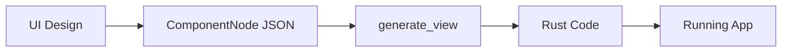
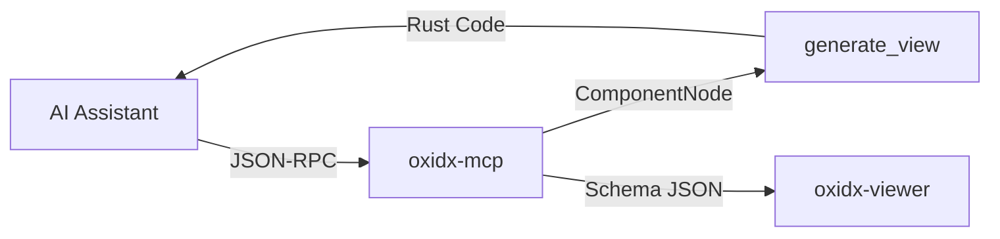
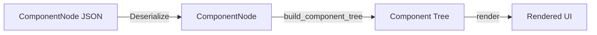
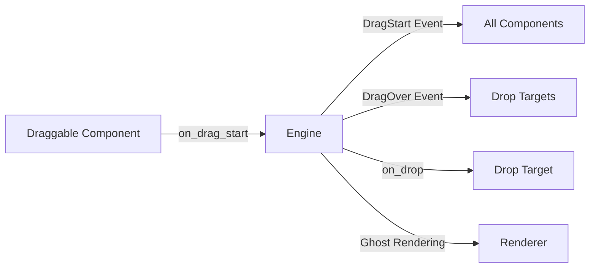

# OxidX Architecture

OxidX is designed as a layered architecture that separates the core engine, platform integration, and high-level component library. This design allows for high performance (GPU acceleration) while maintaining a developer-friendly API.

## High-Level Overview

```mermaid
graph TD
    App[User Application] --> Std[oxidx_std]
    App --> Core[oxidx_core]
    Std --> Core
    Core --> WGPU[wgpu (Graphics)]
    Core --> Winit[winit (Windowing)]
    Derive[oxidx_derive] -.-> App
    CLI[oxidx_cli] -.-> App
```

## 1. Core Engine (`oxidx_core`)

This crate allows the foundational types and systems needed to run an application. It is agnostic of specific UI widgets.

### Key Submodules:

- **`engine`**: Contains the main application loop (`OxidXApp`). It handles window creation, event polling from `winit`, and dispatching events to the component tree.
- **`renderer`**: A batched 2D renderer using `wgpu`. It minimizes draw calls by batching primitives (rectangles, text, glyphs) into vertex buffers. It supports:
  - Scissor clipping (nested)
  - Text rendering via `cosmic-text`
  - Anti-aliased primitives
  - Texture management (image loading, caching, and batched rendering)
- **`events`**: Defines the `OxidXEvent` enum, abstracting low-level OS events (mouse, keyboard, focus) into semantic UI events.
- **`context` (`OxidXContext`)**: A context object passed to components during updates and event handling. It provides access to:
  - Global focus state (Focus Manager)
  - Clipboard operations
  - Cursor icon management
  - IME (Input Method Editor) control
  - Screen scaling factors (DPI)
  - **Global Overlay Queue**: Manages transient UI elements (menus, tooltips) that render on top of the main tree.

### Overlay System

OxidX implements a "Global Overlay" system to handle UI elements that must float above everything else (like Context Menus).
- **Event Priority**: Overlays are processed *first* (in reverse order) during event handling to intercept clicks.
- **Rendering**: Overlays are drawn *last*, bypassing parent clipping regions (`renderer.clear_clip()`).
- **Transient Nature**: Clicking outside an overlay generally triggers a cleanup.

### The Component Trait (`OxidXComponent`)

The core abstraction of OxidX. Every UI element implements this trait.

```rust
pub trait OxidXComponent {
    // Required: Draw yourself
    fn render(&self, renderer: &mut Renderer);
    
    // Required: Where are you?
    fn bounds(&self) -> Rect;
    fn set_position(&mut self, x: f32, y: f32);
    fn set_size(&mut self, width: f32, height: f32);

    // Optional: Lifecycle
    fn update(&mut self, delta_time: f32) {}
    fn layout(&mut self, available_space: Rect) -> Vec2 { ... }
    
    // Optional: Events
    fn on_event(&mut self, event: &OxidXEvent, ctx: &mut OxidXContext) -> bool { false }
}
```

## 2. Standard Library (`oxidx_std`)

A collection of production-ready widgets and containers built on top of `oxidx_core`.

- **Widgets**: `Button`, `Input`, `Label`, `Checkbox`, `TextArea`, etc.
- **Containers**: `VStack`, `HStack`, `ZStack`, `Grid`, `ScrollView`, `SplitView`.
- **Layout System**: Implements a flexbox-like layout engine within the `layout()` method of containers.
- **State Management**: Most widgets use internal state (e.g., `is_hovered`, `is_pressed`) but expose callbacks (`on_click`, `on_change`) for application logic.

## 3. Tooling (`oxidx_derive`, `oxidx_cli`)

- **`oxidx_derive`**: Provides the `#[derive(OxidXComponent)]` macro. This macro analyzes a struct and automatically implements the boilerplate methods for `OxidXComponent` (bounds management, basic layout pass-through, etc.), allowing developers to focus on `render` and `on_event`.
- **`oxidx_cli`**: A command-line tool for:
  - Hot-reloading layouts (`oxidx watch`)
  - Generating Rust code from JSON definitions (`oxidx generate`)
  - Exporting JSON schemas for IDE autocompletion (`oxidx schema`)

## data Flow

1. **Event**: OS generates an event (e.g., MouseMove).
2. **Engine**: Captures event via `winit`.
3. **Dispatch**: The engine converts it to `OxidXEvent`.
4. **Traversal**: The event is propagated through the component tree.
   - **Tunneling/Bubbling**: Currently, OxidX uses a direct dispatch or hit-test based dispatch depending on the event type (Mouse events use Z-order hit-testing; Keyboard events route to the focused component ID).
5. **Update**: Components modify their state in response to events.
6. **Layout**: If requested, a layout pass recalculates positions.
7. **Render**: The engine calls `render()` on the root component, traversing the tree and building a render batch.
8. **Draw**: `wgpu` executes the draw call.

## 4. Code Generation Pipeline

OxidX supports a design-to-code workflow via schema serialization and code generation.



### Schema System (`oxidx_core::schema`)

- **`ComponentNode`**: A serializable representation of a UI component with `type_name`, `id`, `props`, `events`, and `children`.
- **`ToSchema` trait**: Components implement this to export their structure to JSON.

### Code Generator (`oxidx_codegen`)

- **`generate_view(root, view_name)`**: Takes a `ComponentNode` tree and generates a complete Rust struct with:
  - Struct fields for named components
  - Constructor method (`new()`) that builds the UI tree
  - `OxidXComponent` implementation

## 5. MCP Integration (`oxidx_mcp`)

OxidX exposes code generation to AI assistants via Model Context Protocol (MCP).



- **Transport**: stdio JSON-RPC
- **Tool**: `generate_oxid_ui` accepts a schema and returns Rust code
- **Dynamic Component Enum**: The `tools/list` response includes a JSON Schema enum of all 30+ supported components, allowing AI clients to dynamically discover available widgets.
- **Live Preview**: Automatically launches `oxidx-viewer` to render the generated UI.
- **Clients**: Claude Desktop, Cursor, or any MCP-compatible assistant

## 6. Dynamic Component Loader (`oxidx_std::dynamic`)

OxidX supports runtime instantiation of UI components from JSON schemas.



### `build_component_tree(node: &ComponentNode) -> Box<dyn OxidXComponent>`

This factory function recursively builds a component tree at runtime:

- **Containers**: `VStack`, `HStack`, `ZStack` (with recursive children)
- **Widgets**: `Button`, `Label`, `Input`, `Image`
- **Charts**: `Chart` (generic), `PieChart`, `BarChart`, `LineChart`
- **Fallback**: Unknown types render as `Label` with an error message.

### Chart Data Format

Charts accept data in two formats via the `data` prop:

```json
// Object format
{"data": [{"label": "Sales", "value": 100}, {"label": "Costs", "value": 75}]}

// Tuple format
{"data": [["Sales", 100], ["Costs", 75]]}
```

Use `chart_type` prop to select chart type: `"pie"`, `"bar"`, or `"line"` (default: `"bar"`).

## 7. Drag & Drop System

OxidX provides a complete payload-based drag and drop system with visual feedback.



### Component Hooks

Implement these in your `OxidXComponent` to enable drag and drop:

```rust
// For draggable components
fn is_draggable(&self) -> bool { true }
fn on_drag_start(&self, ctx: &mut OxidXContext) -> Option<String> {
    Some(format!("PAYLOAD:{}", self.id))  // Return payload string
}

// For drop targets
fn is_drop_target(&self) -> bool { true }
fn on_drop(&mut self, payload: &str, ctx: &mut OxidXContext) -> bool {
    if payload.starts_with("PAYLOAD:") {
        // Handle drop
        true
    } else {
        false
    }
}
```

### Drag State (`ctx.drag`)

Access drag state during operations:

| Field | Type | Description |
|-------|------|-------------|
| `is_active` | `bool` | Currently dragging? |
| `payload` | `Option<String>` | Payload data |
| `source_id` | `Option<String>` | ID of source component |
| `start_position` | `Vec2` | Where drag started |
| `current_position` | `Vec2` | Current cursor position |

### Visual Feedback

- **Ghost Rendering**: The engine automatically renders a semi-transparent ghost at the cursor position during drag.
- **DragOver Event**: Components receive `DragOver` events to provide visual feedback (e.g., highlight drop zones).
- **Event Flow**: `DragStart` → `DragOver` (continuous) → `DragEnd`

## 8. Modern Styling System

OxidX features a CSS-like styling system for professional UI design.

### Style Struct

```rust
pub struct Style {
    pub background: Background,    // Solid or Gradient
    pub border: Option<Border>,    // Optional border
    pub shadow: Option<Shadow>,    // Drop shadow
    pub text_color: Color,
    pub rounded: f32,              // Corner radius
    pub padding: Vec2,
}
```

### Builder Pattern

```rust
let card_style = Style::new()
    .bg_gradient(Color::BLUE, Color::PURPLE, 90.0)
    .rounded(16.0)
    .shadow(Vec2::new(0.0, 4.0), 12.0, Color::new(0.0, 0.0, 0.0, 0.3))
    .border(1.0, Color::WHITE);
```

### InteractiveStyle

For components with multiple states:

```rust
pub struct InteractiveStyle {
    pub idle: Style,
    pub hover: Style,
    pub pressed: Style,
    pub disabled: Style,
}

// Usage
let state = self.current_state();  // ComponentState enum
let style = interactive_style.resolve(state);
renderer.draw_style_rect(bounds, style);
```

### Theme System

OxidX includes a theming system accessible via `renderer.theme`:

```rust
impl OxidXComponent for MyWidget {
    fn render(&self, renderer: &mut Renderer) {
        let button_style = Self::style_for_variant(&renderer.theme, ButtonVariant::Primary);
        renderer.draw_style_rect(self.bounds, button_style.resolve(self.state));
    }
}
```

Theme provides:
- Pre-built button styles (Primary, Secondary, Danger, Ghost)
- Color palette (primary, success, danger, surface colors)
- Spacing and border radius defaults

